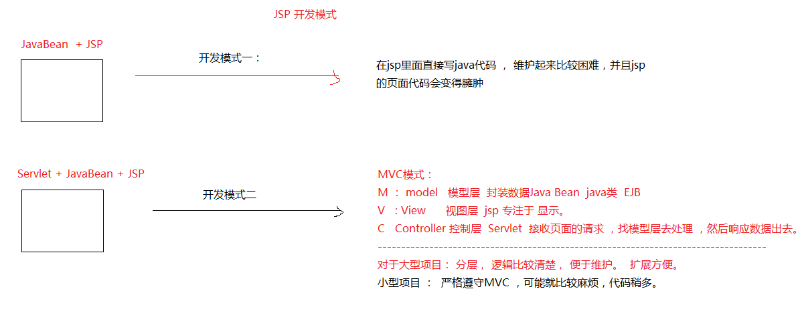

### 1 元数据

`Meata data` 

描述数据的数据 String SQL , 描述这份 SQL 字符串的数据叫做元数据
数据库元数据  DatabaseMetaData
参数元数据  ParameterMetaData
结果集元数据  ResultSetMetaData

### 2 MVC 设计模式

​	MVC 模式（Model–view–controller）是软件工程中的一种软件架构模式，把软件系统分为三个基本部分：模型（Model）、视图（View）和控制器（Controller）。


### 3 JSP 的开发模式



### 4 三层架构&MVC练习


### 5 学生信息管理系统

#### 5.1 数据库准备

```sql
CREATE DATABASE stus;
USE stus;
CREATE TABLE stu (
	sid INT PRIMARY KEY AUTO_INCREMENT,
	sname VARCHAR(20),
	gender VARCHAR(5),
	phone VARCHAR(20),
	birthday DATE,
	hobby VARCHAR(50),
	info VARCHAR(200)
);
```

#### 5.2 查询

1. 先写一个 JSP 页面， 里面放一个超链接 。

   <a href="StudentListServlet"> 学生列表显示</a>

2. 写 Servlet， 接收请求， 去调用 Service  , 由 service 去调用 dao

3. 先写 Dao , 做 Dao 实现。

```java
public interface StudentDao {
    /**
    	查询所有学生
		@return  List<Student>
    */
    List<Student> findAll()  throws SQLException ;
}
public class StudentDaoImpl implements StudentDao {
    /**
    	查询所有学生
    	@throws SQLException
    */
    
    @Override 
    public List<Student> findAll() throws SQLException {
        QueryRunner runner = new QueryRunner(JDBCUtil02.getDataSource());
        return runner.query("select * from stu", new BeanListHandler<Student>(Student.class));
    }
}
```

4. 再 Service , 做 Service 的实现。


```java
/**
    这是学生的业务处理规范
    @author xiaomi
*/
public interface StudentService {
    /**
        查询所有学生
        @return  List<Student>
    */
    List<Student> findAll()  throws SQLException ;
}

------------------------------------------

/**
    这是学生业务实现
    @author xiaomi
*/
public class StudentServiceImpl implements StudentService {
    @Override
    public List<Student> findAll() throws SQLException {
        StudentDao dao = new StudentDaoImpl();
        return dao.findAll();
    }
}
```

5. 在 servlet 存储数据，并且做出页面响应。


```java
protected void doGet(HttpServletRequest request, HttpServletResponse response) throws ServletException, IOException {
    try {
        // 1.查询出来所有的学生
        StudentService service = new StudentServiceImpl();
        List<Student> list = service.findAll();     // 2.先把数据存储到作用域中
        request.setAttribute("list", list);
        // 3.跳转页面
        request.getRequestDispatcher("list.jsp").forward(request, response);
    } catch (SQLException e) {
        e.printStackTrace();
    }
}
```

6. 在list.jsp上显示数据

   EL + JSTL  + 表格

#### 5.3 增加 

1. 先跳转到增加的页面 ， 编写增加的页面

2. 点击添加，提交数据到 AddServlet. 处理数据。

3. 调用 service

4. 调用 dao, 完成数据持久化。

5. 完成了这些存储工作后，需要跳转到列表页面。 这里不能直接跳转到列表页面，否则没有什么内容显示。 应该先跳转到查询所有学生信息的那个Servlet， 由那个Servlet再去跳转到列表页面。

6. 爱好的value 值有多个。 

```java
request.getParameter("hobby");
String[] hobby =     request.getParameterValues("hobby"); 
String value = Arrays.toString(hobby): // [爱好,篮球, 足球]
```

#### 5.4 删除

1. 点击超链接，弹出一个询问是否删除的对话框，如果点击了确定，那么就真的删除。


```jsp
<a href="#" onclick="doDelete(${ stu.sid })">删除</a>
```

2. 让超链接，执行一个js方法


```javascript
<script type="text/javascript">
function doDelete(sid) {
    /*  如果这里弹出的对话框，用户点击的是确定，就马上去请求Servlet。
        如何知道用户点击的是确定。
        如何在js的方法中请求servlet。 
    */
    var flag = confirm("是否确定删除?");
    
    if (flag) {
        // 表明点了确定。 访问servlet。 在当前标签页上打开 超链接，
        // window.location.href="DeleteServlet?sid="+sid;
        location.href = "DeleteServlet?sid=" + sid;
    }
}
</script>
```

2. 在 js 访问里面判断点击的选项，然后跳转到 servlet。

3. servlet收到了请求，然后去调用 service， service去调用dao

#### 5.5 更新

1. 点击列表上的更新， 先跳转到一个 EditServlet 

在这个 Servle t里面，先根据 ID 去查询这个学生的所有信息出来。

2. 跳转到更新的页面，然后在页面上显示数据


```jsp
<table border="0" width="80%">
        <tr>
            <td>Name</td>
            <td><input type="text" name="sname" value="${ stu.sname }"></td>
        </tr>
        <tr>
            <td>Gender</td>
            <td>
                <input type="radio" name="gender" value="Male"
                       <c:if test="${ stu.gender == 'Male' }">checked</c:if>>Male
                <input type="radio" name="gender" value="Female"
                       <c:if test="${ stu.gender == 'Female' }">checked</c:if>>Female
            </td>
        </tr>
        <tr>
            <td>Phone</td>
            <td>
                <input type="text" name="phone" value="${ stu.phone }">
            </td>
        </tr>
        <tr>
            <td>Birthday</td>
            <td>
                <input type="text" name="birthday" value="${ stu.birthday }">
            </td>
        </tr>
        <tr>
            <td>Hobby</td>
            <td>
                <input type="checkbox" name="hobby" value="Swimming"
                       <c:if test="${ fn:contains(stu.hobby,'Swimming') }">checked</c:if>>Swimming
                <input type="checkbox" name="hobby" value="Basket Ball"
                       <c:if test="${ fn:contains(stu.hobby,'Basket Ball') }">checked</c:if>>Basket Ball
                <input type="checkbox" name="hobby" value="Foot Ball"
                       <c:if test="${ fn:contains(stu.hobby,'Foot Ball') }">checked</c:if>>Foot Ball
                <input type="checkbox" name="hobby" value="Reading"
                       <c:if test="${ fn:contains(stu.hobby,'Reading') }">checked</c:if>>Reading
                <input type="checkbox" name="hobby" value="Composing"
                       <c:if test="${ fn:contains(stu.hobby,'Composing') }">checked</c:if>>Composing
            </td>
        </tr>
        <tr>
            <td>简介</td>
            <td>
                <textarea name="info" rows="3" cols="20">
                    ${ stu.info }
                </textarea>
            </td>
        </tr>
        <tr>
            <td colspan="2"><input type="submit" value="Update"></td>
        </tr>
    </table>
```

3. 修改完毕后，提交数据到 UpdateServlet

提交上来的数据是没有带 id 的，所以我们要手动创建一个隐藏的输入框， 在这里面给定 id 的值， 以便提交表单，带上id。 

```html
<form method="post" action="UpdateServlet">
	<input type="hidden" name="sid" value="${stu.sid }">
	
		...
</form>
```

4. 获取数据，调用 service， 调用dao.

#### 5.6 分页功能

* 物理分页 （真分页）

来数据库查询的时候，只查一页的数据就返回了。  

 	优点 内存中的数据量不会太大
	缺点：对数据库的访问频繁了一点。

```sql
SELECT * FROM stu LIMIT	5 OFFSET 2 
```

* 逻辑分页 （假分页）

一口气把所有的数据全部查询出来，然后放置在内存中。 

优点： 访问速度快。
缺点： 数据库量过大，内存溢出。


​		